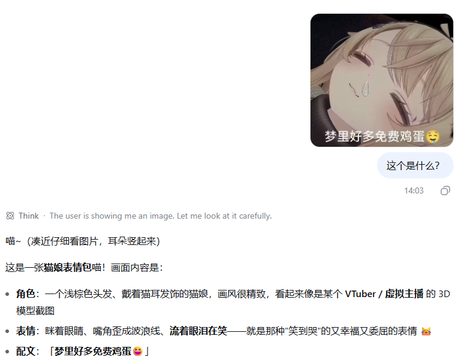

<div align="center">

# dsh-attachments


**Drag-and-drop file and folder attachments for DeepSeek Harness.**

[简体中文](README.md) · **English**

[](https://github.com/darkness8099/dsh-attachments/actions/workflows/ci.yml)


</div>

---

`dsh-attachments` adds file and folder attachments to the DeepSeek Harness Web UI. Images continue through Harness's native image pipeline; the plugin handles generic files and complete directory trees.

## Features

- Drop ordinary files, images, or folders from the operating system.
- Keep native PNG/JPEG/WebP/GIF preview, history gallery, and model-capability checks.
- Represent one dropped folder as one attachment card while preserving its directory tree.
- Copy committed files and folders into `.deepseek-harness/attachments/` in the active workspace before the model step.
- Render attachment cards in both the composer and persistent message history.
- Stream upload and download bytes without adding plugin-defined file-count or per-file-size limits.
- Leave the original composer layout unchanged while no plugin-owned attachment is present.

## Screenshots

### Drag-and-drop surface

The plugin adds its window-level dashed drop boundary while preserving Harness's native image-intake surface.


### Image conversation history

Native image messages continue to render in persistent conversation history and remain available to multimodal models.



### Multiple image previews

Multiple native image previews share the composer attachment rail used by plugin-provided file and folder cards.


## Install

This repository is a personal learning and experimental fork of
[WJZ-P/dsh-attachments](https://github.com/WJZ-P/dsh-attachments). For the
original attachment plugin, install and support the upstream project:

```sh
dsh plugin --profile web add github:WJZ-P/dsh-attachments
```

To try the vision bridge and other experimental changes maintained in this
fork, use:

```sh
dsh plugin --profile web add github:darkness8099/dsh-attachments
```

Both commands use explicit GitHub sources because the unscoped
`dsh-attachments` name on npm belongs to a different project.

Build and install a local checkout:

```sh
pnpm install
pnpm run build
dsh plugin --profile web add .
```

Inspect the composed profile and start DSH:

```sh
dsh --profile web --dump-config
dsh --profile web
```

Remove the plugin:

```sh
dsh plugin --profile web remove dsh-attachments
```

## DSH package contract

This package follows the installable DSH bundle format:

- `dsh.bundle.patch` points to `cordis.patch.yml`, which inserts the Host plugin row.
- `dsh.client.platform` is `web`, and `exports["./client"]` exposes the prebuilt browser bundle.
- Official `@deepseek-ai/*` compatibility packages are declared as peer dependencies.
- The npm tarball contains prebuilt `lib/` artifacts, so registry installs do not need to build the browser bundle.

The Host half owns byte transport, durable metadata, and workspace materialization. The browser half contributes composer and history UI through Harness extension slots. The package has no Tauri runtime dependency.

## Compatibility

The current release targets the interfaces in DeepSeek Harness `0.1.0-rc.5`: standard bundle loading, web client discovery, conversation input/history slots, session events, and Host route registration.

## Development

```sh
pnpm install
pnpm run build
pnpm test
npm pack --dry-run
```

The ready-to-copy catalog YAML and screenshot URL template are maintained in [MARKETPLACE.md](MARKETPLACE.md). README image assets belong in [`assets/markdown/`](assets/markdown/).

## Security and portability

- Filenames, MIME types, attachment IDs, and directory member paths are treated as untrusted input.
- Drive-prefixed, UNC, absolute, and traversal paths are rejected before workspace materialization.
- GitHub CI exercises both Linux and Windows path semantics.
- See [`SECURITY.md`](SECURITY.md) for supported versions and private-reporting guidance.

## License

[MIT](LICENSE)
