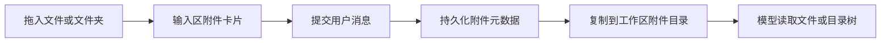

<div align="center">

# 📎 dsh-attachments

**为 DeepSeek Harness 带来直观、持久、低侵入的文件与文件夹附件体验。**

拖放即用 · 保留目录树 · 输入区与历史消息一致展示 ฅ( ̳• ·̫ • ̳ฅ)

[English](README.en.md) · **简体中文**

[](https://github.com/WJZ-P/dsh-attachments/actions/workflows/ci.yml)


</div>

---

## ✨ 功能亮点

| 能力 | 表现 |
| --- | --- |
| 📁 文件夹拖放 | 一个文件夹对应一张附件卡片，同时完整保留内部目录树 |
| 📄 普通文件 | 支持拖入、预览卡片、持久化历史与流式下载 |
| 🖼️ 原生图片共存 | PNG、JPEG、WebP、GIF 继续使用 Harness 原生图片预览、画廊和多模态检查 |
| 🌉 视觉桥接 | 纯文本主模型可组合 DSH 已配置的视觉模型，图片仍保留在原会话中 |
| 🧠 模型可读取 | 提交后写入当前工作区的 `.deepseek-harness/attachments/`，为模型提供明确路径 |
| 🧩 低侵入扩展 | 通过公开的输入附件栏 slot、会话定义与 Host 路由完成集成 |
| 🪶 原布局保持 | 输入区没有插件附件时，页面布局和原版 Harness 保持一致 |

插件自身不设置附件数量或单文件字节上限；实际可用范围由浏览器、运行环境与目标模型共同决定。

## 🖼️ 效果预览

### 拖放界面

拖入文件或文件夹时，只在原界面上方增加清晰的虚线边界，Harness 原生图片接收界面仍然保留。

<p align="center">
  
</p>

### 图片消息历史

原生图片消息继续显示在持久化会话历史中，并可交给支持多模态输入的模型。

<p align="center">
  
</p>

### 多图片预览

多张原生图片与插件提供的文件、文件夹卡片共用同一条输入附件区域。

<p align="center">
  
</p>

## 🚀 安装

当前版本可直接从独立 GitHub 仓库安装到 DSH Desktop 使用的 `desktop` profile：

```bash
dsh plugin --profile desktop add github:WJZ-P/dsh-attachments
```

> [!IMPORTANT]
> npm 上未带 scope 的 `dsh-attachments` 已属于另一个项目，因此当前安装命令显式指定本 GitHub 仓库。

检查组合后的配置并启动 DSH：

```bash
dsh --profile desktop --dump-config
dsh --profile desktop
```

移除插件：

```bash
dsh plugin --profile desktop remove dsh-attachments
```

## 🧭 工作流程



- 浏览器端负责拖放识别、上传、输入卡片和历史渲染；
- Host 端负责字节传输、持久化元数据、下载路由与工作区落盘；
- 图片的上传、预览和持久化继续走 Harness 原生链路；插件的附件 UI 只接管普通文件与文件夹，视觉桥接只在模型适配层组合路由；
- 拖入目录时，内部成员按完整目录树传输，不会拆成大量输入卡片。

## 🌉 视觉桥接

视觉桥接复用 DSH 原生“模型”页面中的提供商、API 地址、密钥和模型协议。插件不会再要求输入一份 API Key，也不会自行实现 OpenAI、智谱或其他提供商的请求格式。

1. 在 DSH 的“模型”页面照常配置任意主模型与至少一个明确声明支持图片输入的模型。
2. 可在当前 profile 的 Loader patch 中显式列出优先用于识图的模型；这里只引用原生提供商和模型 ID，不重复填写 API 地址或密钥。
3. 用户仍在原生模型选择器中正常选择主模型。输入区加入图片且当前模型明确不支持图片时，插件才提供显式候选和自动发现的视觉候选，最终推理仍由当前主模型完成。

例如：

```yaml
- id: dsh-attachments
  config:
    visionBridge:
      visionModels:
        - id: glm-4.5v
          name: GLM-4.5V
          provider: zhipu
          model: glm-4.5v
```

`discoverVisionModels` 默认为 `true`。插件读取 DSH 已注册提供商的模型目录，把明确声明支持 `image` 输入的模型追加到候选列表；显式 `visionModels` 始终置顶并按提供商去重。设置 `discoverVisionModels: false` 可只保留显式白名单。

插件不会通过实际 API 请求探测凭据或账号权限，也不会生成主模型与视觉模型的笛卡尔积。只有请求桥接图片时才从当前会话读取主路由；适配器的全局模型目录保持为空，只为用户选中的视觉候选建立一个当前会话临时路由。用户另选主模型后，旧临时路由不再使用。

视觉候选不会替换 DSH 的默认模型。普通纯文本交互时桥接提示保持隐藏；输入区实际加入图片、当前模型明确不支持图片且至少一个视觉候选可用时，输入框上方才显示英文引导。一个候选显示单个按钮，多个候选按“显式配置优先、其余按提供商分组”的顺序显示视觉专用下拉框。按钮只激活当前会话桥接，用户仍需再次提交消息；插件会立即把底层主模型恢复为未来新会话的默认值。桥接生效后完整引导自动隐藏；存在多个候选时，原生模型选择器左侧显示紧凑的 `Vision` 控件。原生支持图片的当前模型直接走自身多模态链路，不建立桥接。

会话内切换模型沿用同一套能力策略。会话已有原生图片时，用户选择任意明确声明为纯文本的模型，浏览器会在 DSH 收到裸模型选择前预检这个目标；存在可用视觉候选时显示相同的确认引导，确认后以新选择的模型为主模型建立当前会话临时桥接。桥接已经启用且有多个候选时，用户可从原生模型选择器左侧的紧凑控件直接更换视觉路由；切换立即生效但不会发送消息、改变主模型或自动重扫既有证据。原生视觉目标、无图片会话、能力元数据未知的目标，以及没有可用视觉候选的环境继续使用 DSH 原生切换行为。预检不绑定提供商，也不会生成全局主模型×视觉模型别名。

识图结果作为 DSH 标准的折叠“上下文注入”记录写入同一会话；展开即可查看视觉路由与证据全文。原始图片引用不会被删除或替换。当前消息新加入的图片仍在主模型第一次决策前自动识别；历史图片则作为不读取像素的清单交给主模型，由主模型回答数量和文件名等元数据、要求用户明确目标，或通过 `analyze_session_images` 工具选择附件并提出视觉分析指令。插件不再通过自然语言关键词猜测历史图片目标，也不会因多图引用含糊而终止整轮请求。

旧会话采用“新图自动、历史按需”策略：

- 当前消息新附加的图片自动识别；
- 插件向纯文本主模型提供原生 ImageBlock 与旧 markdown 图片引用的稳定清单，统计清单不会读取图片像素；
- 历史图片不会由外围文本规则自动选取；主模型根据用户语义决定直接回答、澄清目标或调用视觉工具；
- 视觉工具只接受清单中的精确附件 ID，并在目标不存在、仅有旧 markdown 引用或超过数量限制时把可解释错误返回主模型；
- 工具默认复用同一附件与视觉路由的最新证据；只有主模型根据用户要求或证据缺口设置 `refresh: true` 时才发起新的付费分析；
- 单张图片的成功证据独立持久化；任一必需图片失败时，主模型不会继续作答；
- 同一识图请求失败、取消或结果不确定时不会自动重复调用；结构化刷新参数可以授权一次新尝试。

插件默认沿用 DSH 的图片数量上限，可用 `visionBridge.maxImagesPerTurn` 进一步收紧单轮识图数量。省略 `visionBridge` 或设置 `visionBridge: false` 时不会注册桥接提供商；启用时默认自动发现视觉候选，显式列表可以为空。若关闭 `discoverVisionModels`，则必须至少配置一个 `visionModels` 条目。这里仅控制组合策略，不保存提供商凭据。

## 📦 DSH 插件约定

本仓库是可直接安装的标准 DSH bundle：

- `package.json` 声明 `dsh.bundle.patch`；
- `cordis.patch.yml` 插入 Host 插件行；
- `dsh.client.platform` 设置为 `web`；
- `exports["./client"]` 暴露预构建浏览器 bundle；
- 官方 `@deepseek-ai/*` 包全部使用 `peerDependencies`；
- 插件与 Tauri API 解耦，可用于原生 DSH Web profile。

## 🧪 开发与验证

环境要求：Node.js `^22.19.0 || >=24.0.0`、pnpm。

```bash
pnpm install
pnpm run build
pnpm test
npm pack --dry-run
```

当前开发版本面向 DeepSeek Harness `0.1.0-rc.6` 的标准 bundle、Web Client 发现、输入附件栏、会话事件、原生附件与 LLM 适配器接口。

## 🛍️ 插件市场

Marketplace 数据模板、截图 URL 和提交前检查项记录在 [`MARKETPLACE.md`](MARKETPLACE.md)，截图源文件位于 [`assets/screenshots/`](assets/screenshots/)。

## 📄 License

[MIT](LICENSE)

<div align="center">

**让附件安安静静待在该在的位置，也让模型更轻松地找到它们。** (｡•̀ᴗ-)✧

</div>
